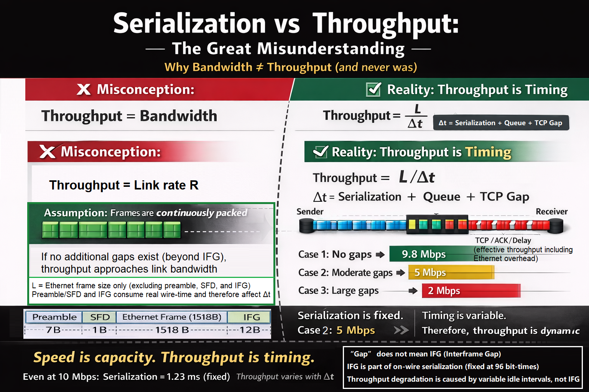
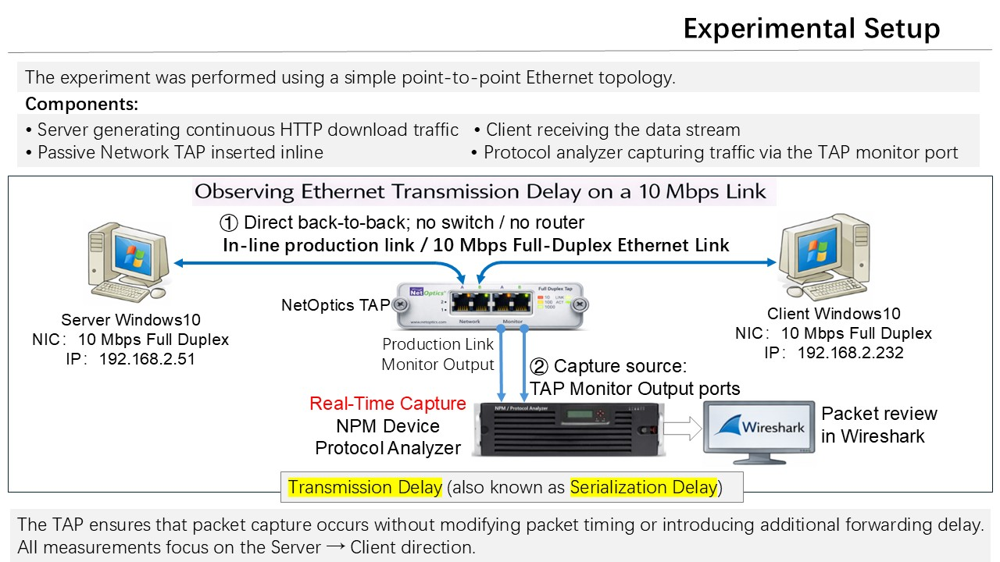
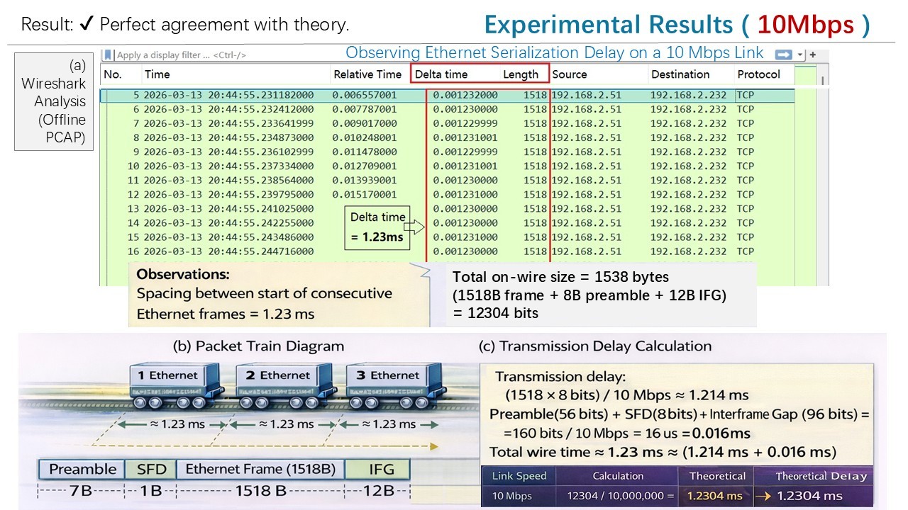
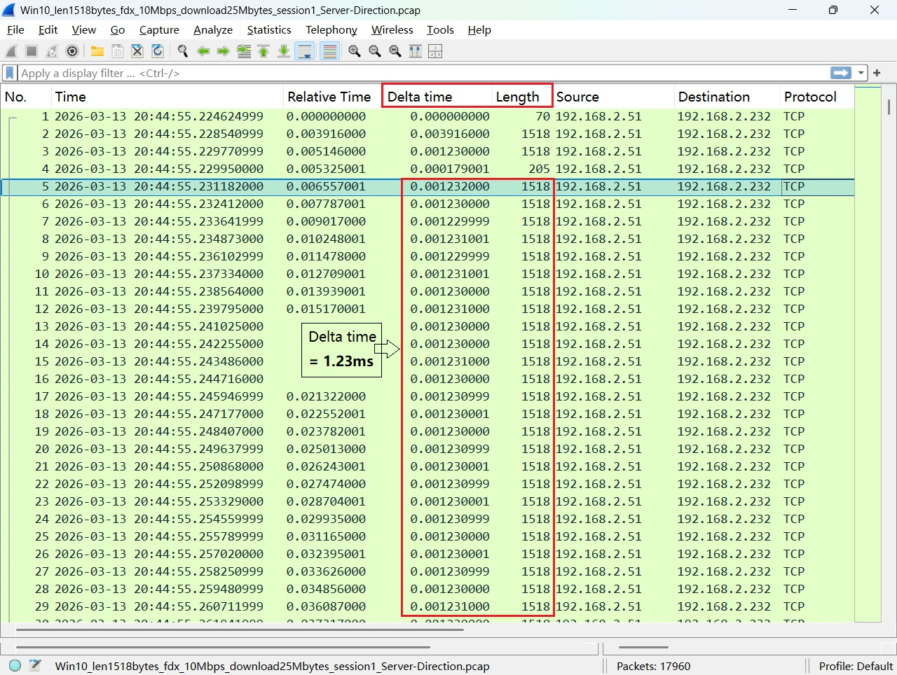

# 🚀 From L/R to Visible Network

> **You are not measuring packets.**  
> **You are watching time.**  
> **Engineers learn L/R.**  
> **Networks reveal Δt.**  

In this figure, L denotes the Ethernet frame size only (1518 bytes in the example),
excluding preamble, SFD, and IFG.

However, preamble/SFD and IFG still consume real wire-time, and are therefore reflected
in the measured inter-frame interval Δt.

For this reason, throughput may be expressed under different conventions:  
(1) frame throughput, counting only the frame itself;  
(2) on-wire throughput, including preamble/SFD;  
and (3) full slot occupancy, including IFG as well.  

All three are valid as long as the definition is stated explicitly.

---

## 🧠 What This Project Is

Most engineers know:

    Serialization Delay = L / R

Where:
L denotes the Ethernet frame size in bits 
(excluding preamble, SFD, and IFG),
and R is the link transmission rate.

For Ethernet, the minimum inter-frame spacing (IFG)
is fixed at 96 bit-times and is not included in L.

---

However, in real networks, what we can observe is not L/R directly,
but the inter-frame arrival time Δt.

This measured Δt includes:

• Frame transmission time (L/R)  
• Preamble and SFD (on-wire bits)  
• IFG (mandatory spacing)  
• Additional idle time (queueing, TCP gaps, etc.)  

---

Therefore:

    Throughput = L / Δt

And in general:

    Δt ≥ L / R

---

This project bridges the gap:

From:
    A textbook formula (L/R)

To:
    A visible, measurable network behavior (Δt)

---

## ⚡ Core Insight

> **Serialization is constant.  
> Throughput is not.**

---

## 🧩 The Mental Model

Throughput = Frame Size / (Serialization + Gap)

---

## 🔥 Why This Matters

Even on a perfect **10 Mbps link**, you may observe:

- 9.8 Mbps  
- 5 Mbps  
- 2 Mbps  

👉 The link didn’t change.  
👉 **The timing did.**

---

## 🧪 Lab Topology

---

## ⏱️ What You Are Actually Observing

### Packet Train(Concept)

Frame1 Frame2 Frame3 Frame4
|-----| |-----| |-----| |-----|

👉 Continuous → Full throughput  
👉 Gaps → Throughput drop  

---

### 📸 Packet Train (Observed Reality)

Each spacing (Δt ≈ 1.23 ms) represents one full frame transmission on the wire.

Throughput is therefore the inverse of this spacing.

---

### The Full System

Serialization → Packet Train → ACK Clock → Queue → Throughput

---

## 📊 Expected Results

| Link Speed | Frame Size | On-Wire Size | Δt (Theory) | Δt (Observed) |
|------------|------------|--------------|-------------|----------------|
| 10 Mbps    | 1518 B     | 1538 B       | ~1.23 ms    | ✔ Match        |
| 100 Mbps   | 1518 B     | 1538 B       | ~0.123 ms   | ✔ Match        |
| 1 Gbps     | 1518 B     | 1538 B       | ~0.0123 ms  | ✔ Match        |

**Note:**

- Frame Size (1518 B) refers to the Ethernet frame only  
  *(excluding preamble, SFD, and IFG)*

- On-Wire Size (1538 B) includes the full transmission footprint per frame:
Preamble (7B) + SFD (1B) + Frame (1518B) + IFG (12B) = 1538B

- Δt (Theory) is calculated based on **on-wire transmission time**, not just frame size:

Δt = (On-Wire Size × 8) / Link Speed

- Therefore, although L is defined as frame size (1518 B),  
**the measured Δt naturally includes preamble, SFD, and IFG**,  
since they consume real wire-time.

---

## 📸 Packet Evidence

### 10 Mbps

- Δt ≈ 1.23 ms  
- Very stable spacing  

---

### 100 Mbps

- Δt ≈ 0.123 ms  
- 10× compression  

---

### 1 Gbps

- Δt ≈ 0.012 ms to 0.013ms  
- Approaching timestamp precision limit  

---

## 🔬 Reproducible Steps

### 1️⃣ Setup

- Direct connection (Client ↔ Server)
- Fix NIC speed (10M / 100M / 1G)
- Insert TAP
- Connect analyzer

---

### 2️⃣ Generate Traffic

curl -O http://192.168.2.51/25Mbytes.doc
 

---

### 3️⃣ Capture

- Use NPM Device / Protocol Analyzer
- Capture on TAP monitor port

---

### 4️⃣ Filter

tcp.stream eq X

---

### 5️⃣ Measure

Look at:

---

Time delta from previous frame
 

---

## 6️⃣ Validate

Check:

- Does inter-frame spacing (Δt) match the expected serialization delay (L/R)?
- Are frames continuous (full utilization)?
- Do gaps appear (throughput collapse)?

---

## ⚠️ Measurement Validity

> TAP aggregation does NOT affect serialization measurement.

Because:

- Serialization happens **before TAP**
- TAP only mirrors traffic
- Timing remains intact

---

## 🧭 What Changes After This Lab

Before:
- You see packets

After:
- You see timing
- You see gaps
- You see TCP rhythm
- You see queue buildup

---

## 🧠 One-Line Summary

> **Bandwidth tells you capacity.  
> Timing tells you reality.**

---

## ⭐ Final Thought

> Most engineers measure throughput.  
> Few measure time.  
> **Fewer understand that throughput is time.**

---

## 📦 Future Work

- ACK Clock visualization  
- CUBIC behavior  
- BDP limits  
- Queue dynamics  

---

## 📎 License

MIT

---

## 🙌 Author

25+ years in Network Performance Monitoring  
Finally decided to *look at L/R seriously*

## 📸 Image Attribution

- Serialization vs Throughput diagram: generated for this project
- Lab topology diagram: original work by the author
- Packet analysis screenshots: obtained using Wireshark (open-source tool)

